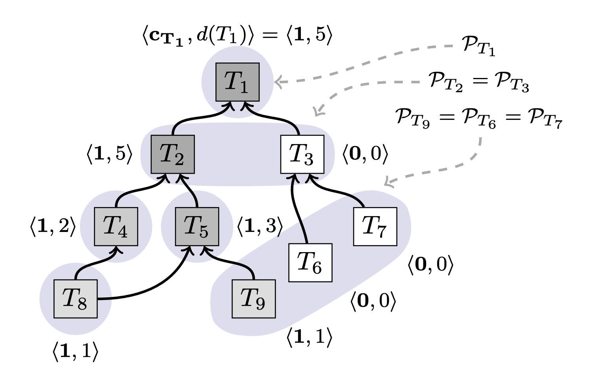

# Avalanche Consensus Protocol

Avalanche is a new family of consensus protocols inspired by gossip algorithms. The protocol is based 
on random sampling and meta-stable decision, and provide a strong probabilistic safety guarantee.

This protocol family achieves its properties by humbly cheating in three different ways:

1. Adopting a safety guarantee that is probabilistic.
1. Establishing only partial order between dependent transactions.
1. No liveliness guarantee for misbehaving clients.

## Guarantees

Avalanche protocol provides the following guarantees with high probability:

- **Safety:** No two correct nodes will accept conflicting transactions.
- **Liveliness:** Any transaction issued by a correct client will eventually be accepted by every correct
node.

## Assumptions

Avalanche protocol makes following assumptions:

- A synchronous network.
- All members of a network are not known to all participants.
- A safe bootstrapping system that enables a node to connect with sufficiently many correct nodes.

## Approach

Avalanche starts with a non-Byzantine protocol and progressively build on it to arrive at Byzantine Fault 
Tolerant (BFT) protocol. It consists of following four protocols:

1. Slush
1. Snowflake
1. Snowball
1. Avalanche

### Slush: Introducing Meta-stability

- A node starts out with an uncolored state.
- Upon receiving a transaction, an uncolored node updates its own colour to the one carried in the 
transaction and initiates a query.
- To perform a query, a node picks a small, constant sized \\( (k)\\) sample of the network uniformly
at random, and sends a query message.
- Upon receiving a query, an uncolored node adopts the colour in the query, responds with that colour,
and initiates its own query, whereas a coloured node simply responds with its current colour.
- Once the querying node collects \\( k\\) responses, it checks if a fraction \\( \geq \alpha k\\) are
for the same colour, where \\( \alpha \gt 0.5\\) is a protocol parameter.
- If the \\( \alpha k\\) threshold is met and the sampled colour differs from the node's own colour, the
node flips to that colour.
- It then goes back to the query step , and initiates a subsequent round of query, for a total of 
\\( m\\) rounds.
- Finally, the node decides the colour it ended up with after \\( m\\) rounds.

### Snowflake: BFT

- Each node maintains a counter \\( cnt\\).
- Upon every colour change, the node resets \\( cnt\\) to \\( 0\\).
- Upon every successful query that yields \\( \geq \alpha k\\) responses for the same colour as the node,
the node increments \\( cnt\\).
- A node accepts the current colour when its counter exceeds \\( \beta\\), another security parameter.

### Snowball: Adding Confidence

- Each node maintains a _confidence counter_.
- Upon every successful query, the node increments its confidence counter for that colour.
- A node switches colours when the confidence in its current colour becomes lower than the confidence
value of the new colour.
- A node decides a colour if, during a certain number of consecutive queries, its confidence for that
colour exceeds that of other colours.

### Avalanche: Adding a DAG

- Each node maintains a dynamic append-only Directed Acyclic Graph (DAG) of all known transactions.
- The DAG has single sink that is _genesis vertex_.
- When a client creates a transaction, it names one or more _parents_, which are included inseparably
in that transaction and form the edges of the DAG.

We use the term _ancestor set_ to refer to all transactions reachable via parent edges back in history, 
and _progeny_ to refer to all children transactions and their offspring.

The central challenge in the maintenance of the DAG is to choose among _conflicting transactions_. For 
example, in a cryptocurrency application, transactions that spend the same funds (_double-spends_) 
conflict, and form a _conflict set_, out of which only a single one can be accepted. Note that the conflict 
set of a correct transaction is always a singleton. Also, it is worth noting that each transaction in a
conflict set may have different parent transaction (this depends on implementation of parent selection).

- When a transaction \\( T\\) is queried, all transactions reachable from \\( T\\) by following the DAG
edges are implicitly part of the query.
- A node will only respond positively to the query if \\( T\\) and its entire _ancestry_ are currently the
preferred option in their respective conflict sets.
- If more than a threshold of responders vote positively, the transaction is said to collect a _chit_, 
\\( c_{uT} = 1\\), otherwise \\( c_{uT} = 0\\).
- Nodes then compute their _confidence_ as the sum of chit values in the _progeny_ of that transaction.
- Nodes query a transaction just once and rely on new vertices and chits, added to progeny, to build up
their confidence.
- Ties are broken by an initial preference for the first-seen transactions.

## Specification

- Each correct node \\( u\\) keeps track of all transactions it has learned about in a set \\( \mathcal{T}_u\\),
partitioned into mutually exclusive conflict sets \\( \mathcal{P}_T\\), where \\( T \in \mathcal{T}_u\\).
Since conflicts are transitive, if \\( T_i\\) and \\( T_j\\) are conflicting, then 
\\( \mathcal P\_{T_i} = \mathcal P\_{T_j}\\)
- We write \\( T' \leftarrow T\\) if \\( T\\) has a parent edge to \\( T'\\).
- Each node \\( u\\) can compute a confidence value for transaction \\( T\\), \\( d_u(T)\\), from the
progeny as follows:
\\[ d_u(T) = \sum_{T' \in \mathcal T_u, T \leftarrow T'} c\_{uT'} \\]
Above formula means that the confidence value of a transaction is sum of confidence values of its
children. If there are no children, then the confidence value is equal to chit collected by that transaction.

    

### Process

- When a node \\( u\\) discovers a transaction \\( T\\) through query, it starts a one-time query process by
sampling \\( k\\) random peers.
- A query starts by adding \\( T\\) to \\( \mathcal T\\), initializing \\( c_T\\) to \\( 0\\), and then sending
a message to selected peers.
- Node \\( u\\) answers a query by checking weather each \\( T'\\) such that \\( T' \leftarrow T\\) (i.e., every 
parent of \\( T\\)) is currently preferred among their respective conflict sets, \\( \mathcal P_{T'}\\).
  - If every single ancestor \\( T'\\) fulfills this criterion, the transaction is said to be _strongly preferred_,
  and receives a yes-vote(1).
  - A failure of this criterion at any \\( T'\\) yields a no-vote (1).
- When \\( u\\) accumulates \\( k\\) responses, it checks weather there are \\( \alpha k\\) yes-votes for \\( T\\),
and if so grants the chit \\( c_T = 1\\) for \\( T\\).

The above mentioned process is brief of Avalanche Consensus Algorithm. To understand it fully, it is recommended to
read **Section 2.6** along with the **pseudo-code** in [Avalanche Paper].

[Avalanche Paper]: https://ipfs.io/ipfs/QmUy4jh5mGNZvLkjies1RWM4YuvJh5o2FYopNPVYwrRVGV
